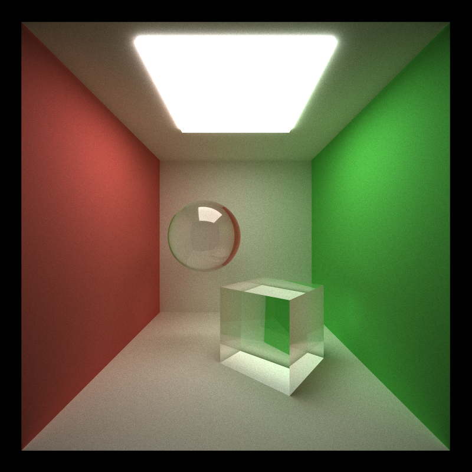
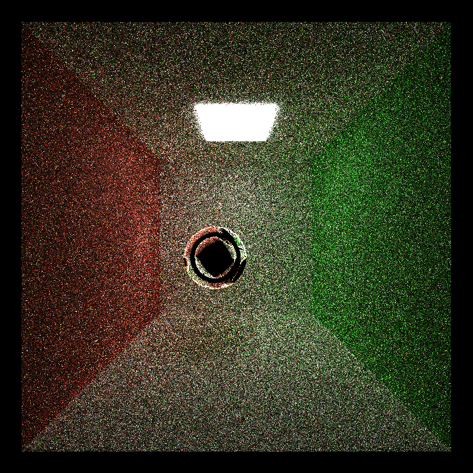

**University of Pennsylvania, CIS 565: GPU Programming and Architecture, Project 3**

* Anya Agarwal
  * [LinkedIn](https://www.linkedin.com/in/anya-agarwal/)
* Tested on: Windows 11, AMD Ryzen 7 260 @ 380GHz 16GB, RTX 5060

# CUDA Path Tracer

     

## Overview
The goal of this project was to implement a pathtracer written in CUDA and C++, and utilize the GPU to parallelize and speed up the pathtracing processes. Pathtracing is a method to render 3D models and scenes. It essentially traces the path of several rays per pixel as they bounce through the scene and capture information on illumination, shadows, reflections, and more. Using the GPU to pathtrace instead of the CPU achieves an incredible performance boost, as ray calculations are able to run simultaneously. Listed below are the several features I have implemented that extend the functionality of a basic pathtracer:

Core Features
* Ideal Diffuse and Perfect Specular Surface Shading
* Stream Compacted Path Termination
* Rays, Paths, and Intersections Contiguous in Memory
* Stochastic Sampled Antialiasing

Additional Features
* Refraction with Fresnel effects
* Physically-based Depth-of-Field
* Texture Mapping, Bump Mapping, and Procedural Texturing
* Arbitrary Mesh Loading and Rendering
* Hierarchal Spatial Data Structures

## Visual and Mesh Improvements

### Ideal Diffuse, Perfect Specular, and Refraction Surface Shading
Surface reflection models are created by calculating how light is transmitted when hitting a surface. We can use the physical properties of certain materials to determine the direction and intensity of the scattered rays. An ideal diffuse surface scatters light evenly in all directions, which creates a simple, matte look. A perfect specular surface causes light to bounce back in a single direction, which results in a mirror-like surface. 

For refraction, the light rays bend and distort as they pass through a more transparent material, creating the effect of glass or water. I used the Fresnel formula for these dielectric materials, as outlined in [PBRTv4 9.5](https://pbr-book.org/4ed/Reflection_Models/Dielectric_BSDF). I implemented all of these surface shaders within one large shader kernel, which checks to see if the material has certain properties before deciding how to reflect the light rays. Because of this, there isn't much of a performance difference between the different shaders. The refraction model does involve more computational work, which shaves off a few frames per second. I believe it helps that the shader is run on the GPU as opposed to the CPU, as several rays can be calculated in parallel, speeding up the process. In the future, I would try to separate the large shading kernel into smaller ones to reduce branch divergence.

|Diffuse (Avg. FPS: 46.2) | Specular (Avg. FPS: 45.8) | Refraction (Avg. FPS: 43.6)|
|------------------------|------------------------|------------------------|
| |  | |

### Stochastic Sampled Antialiasing
Implementing stochastic sampled antialiasing allows for smoother edges instead of jagged ones, which are oftentimes created with rendered lines that travel in a diagonal. This is achieved by randomly jittering the ray direction within a pixel, which allows different areas of the pixel to be sampled. It doesn't affect performance time much, and it creates smoother renders.

|Without Antialiasing (Avg. FPS: 35.1) | With Antialiasing (Avg. FPS: 35.3) | 
|------------------------|------------------------|
| |  |

### Physically-based Depth-of-Field
I used the concepts outlined in [PBRTv4 5.2.3](https://pbr-book.org/4ed/Cameras_and_Film/Projective_Camera_Models#TheThinLensModelandDepthofField) to implement physically-based depth-of-field. It uses a set lens aperture to focus all of the rays toward a set focal distance. This creates an effect of sharp objects at certain distances, and blurry objects at other distances. Since this is implemented on the GPU, it is parallelized, which is once again more efficient than having it run on the CPU. Even though creating the depth-of-field effect requires a little more computational work, it is not enough of a difference to be noticed during the final rendering.

|Without Depth of Field (Avg. FPS: 39.9) | With Depth of Field (Avg. FPS: 40.1) | 
|------------------------|------------------------|
| |  |

### Arbitrary Mesh Loading and Rendering
To make the scenes more visually interesting, I implemented the ability to load OBJ files into the pathtracer. OBJ files are a 3D model format that stores information such as vertex positions, surface normals, and more. To load the object, I parsed the OBJ file and stored the mesh information as a list of triangles. Rendering the object involves using the list of triangles to calculate intersections and create the shading for each triangle. Loading and rendering an OBJ file is extremely time and work intensive, as there could be hundreds of thousands of triangles within a single mesh. To fix this, I implemented bounding volume intersection culling in the form of a BVH tree structure. This reduces the number of rays that need to be checked for the entire mesh, speeding up the process of rendering by an incredible amount. More information on BVH is given below in the Performance Improvements section. Loading the OBJ file is done on the CPU, as it doesn't functionally make sense to parallelize the process of parsing through the file to get information about the triangles. The culling is also done on the CPU, but implementing it on the GPU could potentially speed things up even more.

 

### Texture Mapping, Bump Mapping, and Procedural Texturing
To make my 3D models more realistic, I implemented the ability to add textures and bump maps. This process involves taking a 2D texture image or bump map image and applying it to the 3D model using UVs calculated from the OBJ file information. I also used the [CUDA Texture Object API](https://docs.nvidia.com/cuda/cuda-c-programming-guide/index.html#texture-object-api) to perform some of the calculations needed. A texture image provides a color to sample from, to light the rays accordingly. A bump map makes the 3D model look more realistic and simulates small irregularities in the texture, by editing the surface normals during the shading process. I also made it possible to add procedural textures to a mesh. To test this out, I created a simple procedural texture which simulates a checkerboard pattern, given two colors and a scaling for the size of the squares. The final mapping of these three textures is done in the shading kernel, as each ray and its corresponding calculations are able to be run in parallel on the GPU. If implemented on the CPU without the parallelization, it would most certainly slow down the process. Texturing in general does cause a small slowdown, as each intersection needs to sample from the different texture images. As mentioned above, in the future I would try to make a separate texturing kernel to avoid branch divergence.

|Texture File Only (Avg. FPS: 25.9) | Texture and Bump (Avg. FPS: 24.6) | Procedural Texture (Avg. FPS: 26.2)|
|------------------------|------------------------|------------------------|
| |  | |

(The diffuse average FPS was 26.3)

### Environment Mapping
I implemented environment mapping in a similar fashion to how I implemented texture and bump mapping. I once again used the CUDA Texture Object API to load in information about the environment file, and perform computations with it. I use HDRI files for the environment, taken from [Poly Haven](https://polyhaven.com/). Interestingly, if I used an environment map and get rid of the Cornell box, the FPS doubles. This is probably due to the fact that there are a lot fewer intersections happening, and all there is to be computed for a missed intersection is the color from the environment file. Once again, running this on the GPU versus CPU allows for the parallelizing of these ray calculations.

|Sky / Diffuse (Avg. FPS: 81.2) | Grass / Mirror (Avg. FPS: 79.9) | 
|------------------------|------------------------|
| |  |

## Performance Improvements

### Stream Compacted Path Termination
In a [previous project](https://github.com/anya0402/Project2-Stream-Compaction), I implemented the process of stream compaction to remove elements from an array based on some condition. Within that project, I found that the Thrust library implementation of stream compaction performs better than my version, so I decided to use Thrust in this project. Using stream compaction, I removed rays that had finished bouncing around the scene and didn't need to have calcuations performed on it anymore. Especially since the pathtracing is done on the GPU, it is extremely important to try to avoid wasted work so that threads don't do unnecessary computations. Stream compaction can not only improve performance directly, but also allow for better memory coherence. 

 

|              | Without Stream Compaction | With Stream Compaction |
| ------------ | ------------------------- | ---------------------- |
| Open Scene   | 15.1 FPS                     | 20.8 FPS                  |
| Closed Scene | 12.9 FPS                     | 14.2 FPS                  |

The above graph shows exactly how stream compaction can be useful. In the closed scene (four walls in the box), we can see that stream compaction actually doesn't provide much of a speed up. However, in the open scene (three walls in the box), there is a considerable speed up with stream compaction. This phenomenon happens because in a closed scene where no light can escape, there are barely any rays actually being terminated, which means that there aren't very many rays to get rid of. In an open scene, there are a lot more rays escaping the scene, so stream compaction actually gets rid of a large amount of rays and speeds up the overall process.

In this graph above, we see the raw results of stream compaction working during a single iteration. Without stream compaction, no rays ever leave the buffer, so we have a constant amount of rays throughout the whole process. With stream compaction, we can visibliy see that the number of rays dramatically decreases until we reach the maximum depth and we have no rays left - which is when we move to the next iteration. This shows us that stream compaction is working in our favor to decrease the size of the ray buffer and help with optimization.

### Sort Paths by Material
To further optimize the pathtracer, I tried to sort the rays by material type before I executed the shading kernel. Ideally, this would speed things up since threads for rays that have the same material would be processed together, which would allow for more effective cache hits. However, it turns out that sorting the paths by material drastically slowed down the pathtracer. The size of the ray buffer is quite large most of the time, and the actual sorting is done during each iteration of the pathtracer. Therefore, it seems that the overhead of doing the sorting actually outweighs any performance optimizations that it would theoretically get. 

|Without Material Sort | With Material Sort | 
|------------------------|------------------------|
|Avg. FPS: 41.2 | Avg. FPS: 16.7 |

### Hierarichal Spatial Data Structures
The best performance improvement of this project by far is the implementation of a Bounding Volume Hierarchy (BVH). This is a tree structure that is built by encapsulating the mesh into a bounding box, and repeatedly subdividing it into smaller bounding boxes. This results in a tree where each leaf node stores a small portion of the triangles in the mesh, with a bounding box surrounding this portion of triangles. With this hierarchy, rays don't have to test every single triangle for an intersection anymore. Instead, they can test every bounding box, and if that box is hit, then it can iterate through the triangles within that box only. I followed [Jacco Bikker's blog](https://jacco.ompf2.com/2022/04/13/how-to-build-a-bvh-part-1-basics/) for the implementation of BVH, and integrated it into my pathtracer pipeline to use triangles from an OBJ file and shade them accordingly. I specifically used an axis-aligned bounding box, and the split point I used to subdivide a bounding box was the center of its longest axis.

The process to create and integrate the BVH was rough, with several hours and days spent debugging. Once I got the BVH to render correctly, I ran into the problem that it didn’t actually create any speedup. This was the hardest part to debug, as it was hard to get visual feedback. One of the few slowdowns I found was in the subdivision function, where I was using a reference to the current node instead of indexing directly, which caused performance issues. Changing this improved speed, possibly due to reduced overhead. Changing these issues as well as a few others finally provided me with a fully functioning BVH.

 

|                 | Without BVH | With BVH |
| --------------- | ----------- | -------- |
| 800 Triangles   | 5.9 FPS       | 22.1 FPS    |
| 36.5k Triangles | 2.1 FPS        | 19.2 FPS    |

From the graph, we can clearly see how BVH provides a massive speedup in rendering larger meshes with more triangles. Even with a smaller number of triangles, BVH speeds up the process immensely. The BVH tree structure is built on the CPU, but in the future I'd like to try to build it on the GPU to take advantage of parallelism. I'd also want to improve on the construction of the BVH, like choosing a better split heuristic than the longest axis.

Thank you for checking out my pathtracer!! :)

## Bloopers
Here are some blooper images I accidentally generated during the process of debugging or when things completely broke!

      

## References
* Refraction Model: [PBRTv4 9.5](https://pbr-book.org/4ed/Reflection_Models/Dielectric_BSDF)
* Depth of Field: [PBRTv4 5.2.3](https://pbr-book.org/4ed/Cameras_and_Film/Projective_Camera_Models#TheThinLensModelandDepthofField)
* OBJ File Loader: [tinyObjLoader](https://github.com/tinyobjloader/tinyobjloader)
* Texture Mapping: [CUDA Texture Object API](https://docs.nvidia.com/cuda/cuda-c-programming-guide/index.html#texture-object-api)
* BVH: [How to Build a BVH by Jacco Bikker](https://jacco.ompf2.com/2022/04/13/how-to-build-a-bvh-part-1-basics/)
* Textures: [Poly Haven](https://polyhaven.com/)
* 3D Models: [Turbo Squid](https://www.turbosquid.com/)

### CMakeList.txt Changes
I added the following files to CMakeList.txt:
* src/bvh.h
* src/bvh.cpp
* src/tiny_obj_loader.cc